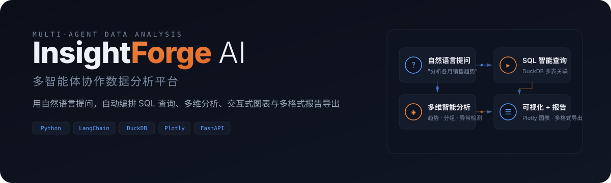
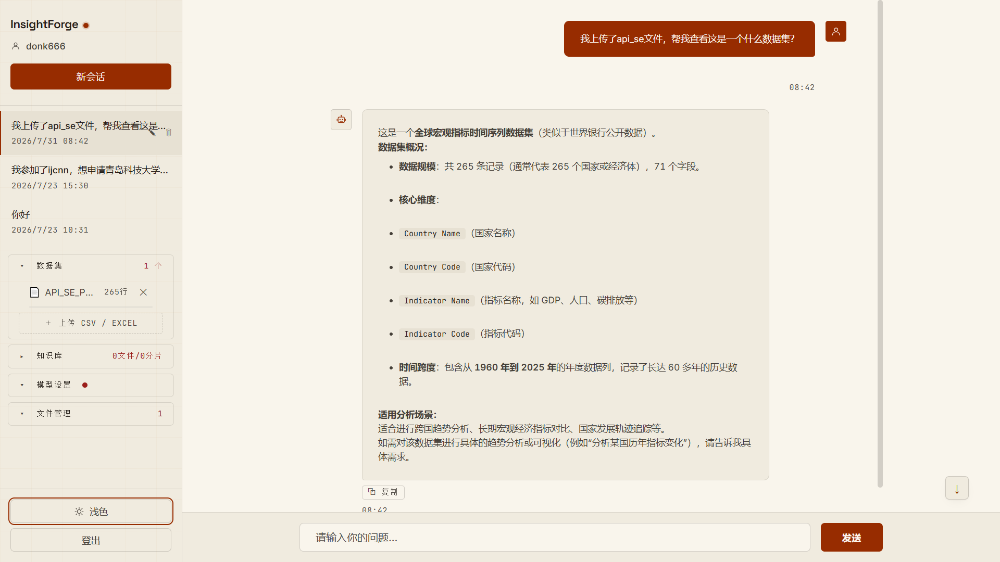
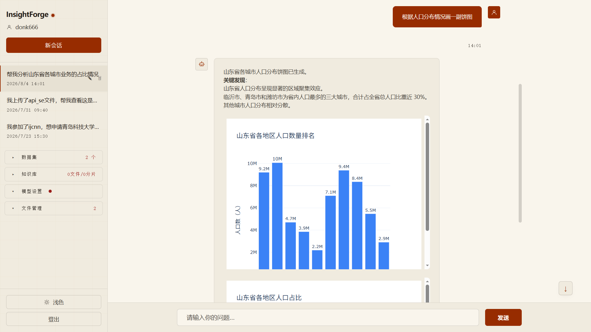
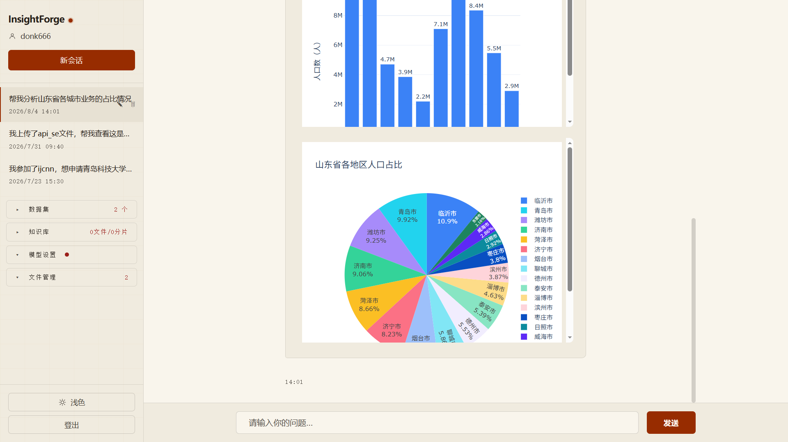
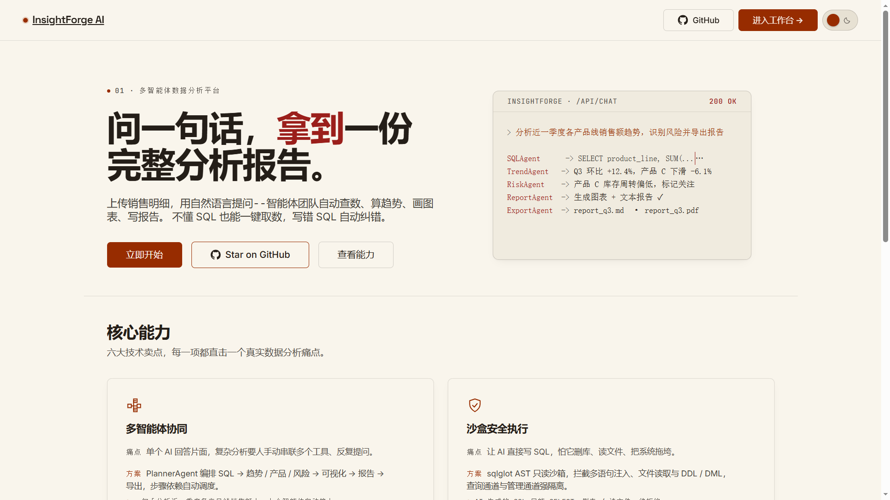
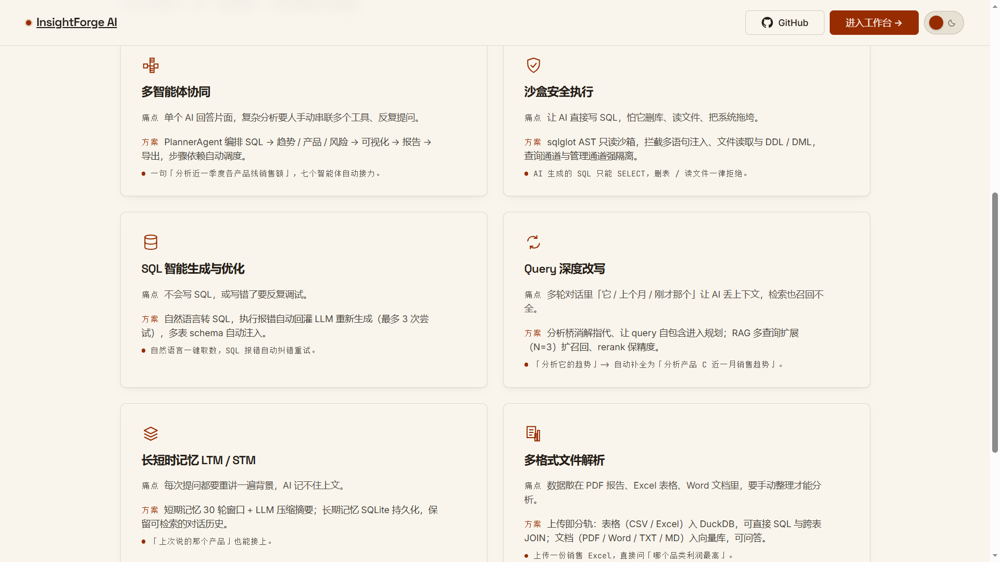

<p align="center">
  
</p>

> **面向数据分析师提效与业务人员自助取数。** 上传数据，用自然语言提问，AI 智能体自动完成 SQL 查询、多维分析、交互式图表与多格式报告导出——无需手写一行代码。

---

## 界面预览

<p align="center">
  
</p>

<p align="center">
  
</p>

<p align="center">
  
</p>

<details>
<summary><b>查看落地页</b></summary>
<p align="center">
  
  
</p>
</details>

---

## 这是什么

**InsightForge AI** 是一个基于 LangChain + LangGraph 的多智能体协作数据分析平台。它以一个智能客服 Agent 为单一入口，由 LLM 根据 15 个工具描述**自主决策**：直接作答、RAG 知识库问答，还是触发完整分析流水线。

分析流水线一旦触发，PlannerAgent 生成执行计划，依次调度 SQLAgent（自动生成并执行查询）→ AnalysisAgent（趋势/分组/异常检测）→ VisualizationAgent（交互式图表）→ ReportAgent（文本分析报告）→ ExportAgent（多格式导出），全链路自动完成。

---

## 为什么不同

- 🔌 **单入口 + LLM 自主路由** — 15 个工具动态决策，一句话触发全链路分析，无需手动选择分析类型
- 🛡️ **sqlglot AST 级 SQL 只读沙箱** — 拦截注入与 DDL/DML，`safe_ident` 转义标识符，安全执行用户查询
- 🗄️ **按用户隔离的内存 DuckDB OLAP** — 支持跨源 JOIN（MySQL / PostgreSQL），多用户数据完全隔离
- 🔍 **两阶段 RAG 检索** — ChromaDB 粗召 + DashScope `gte-rerank-v2` 精排（阈值 0.3），自动降级容错
- 🧠 **两级记忆系统** — Session 级隔离 + 90% 上下文预算自动压缩 + 跨会话语义召回注入
- 📊 **Schema 语义画像** — 列级统计 + 宽表检测，自动注入 SQL 生成提示，提升查询准确率
- 📄 **多格式报告导出** — Word / Markdown / PDF / HTML 一键导出，图表 PNG 栅格化嵌入，PDF 支持中文字体
- ⚙️ **配置热重载** — 网页端修改 API Key / 模型名即时生效，免重启；密钥 Fernet 加密本地存储
- 📡 **SSE 实时进度推送** — 步骤清单实时更新 + 15s 心跳保活，长任务进度透明可见

---

## 如何工作

```
用户提问 → PlannerAgent 生成执行计划 → 调度执行
                                          │
    ┌─────────────────────────────────────┼─────────────────────────────────────┐
    ▼                                     ▼                                     ▼
SQLAgent                            AnalysisAgent                      VisualizationAgent
(DuckDB 多表查询)                    (趋势/分组/异常检测)                  (Plotly 交互图表)
    │                                     │                                     │
    └─────────────────────────────────────┼─────────────────────────────────────┘
                                          ▼
                                   ReportAgent
                                   (文本分析报告)
                                          │
                                          ▼
                                   ExportAgent
                                   (Word/PDF/HTML/MD)
```

完整架构文档见 [架构总览](docs/ARCHITECTURE.md) 与 [核心设计深度剖析](docs/DESIGN_DETAILS.md)。

---

## 快速开始

**环境要求：** Python 3.10+ · [DashScope API Key](https://dashscope.console.aliyun.com/apiKey)（通义千问）

```bash
git clone https://github.com/MynameisKcy/InsightForge-AI.git
cd InsightForge-AI/agent
conda create -n AnalysisAgent python=3.10 -y && conda activate AnalysisAgent
pip install -r requirements.txt
cp .env.example .env          # 编辑 .env 填入 DASHSCOPE_API_KEY
python -m api.fastapi_server  # 访问 http://localhost:8502
```

注册 → 登录后，在侧边栏上传一份 CSV，待状态显示「已就绪」后直接提问：

> 分析各月销售趋势并生成报告

系统自动走 SQL → 趋势分析 → 可视化 → 报告 → 导出全链路。Plotly 交互图表内嵌于对话流中，可一键导出为 Word / PDF / HTML / Markdown。

> 💡 也可在网页「账号设置」面板填写配置——保存即时生效，无需重启；网页配置优先级高于 `.env`。

---

## 技术栈

| 类别 | 技术 |
| :--- | :--- |
| AI 框架 | LangChain 1.3 / LangGraph 1.2 |
| LLM | 通义千问（ChatTongyi）/ OpenAI 兼容（ChatOpenAI） |
| 向量库 & Rerank | ChromaDB + DashScope Embeddings / gte-rerank-v2 |
| OLAP 引擎 | DuckDB（按用户 :memory: 实例，postgres_scan / mysql_scan 跨源） |
| SQL 安全 | sqlglot（AST 只读沙箱 + safe_ident 转义） |
| 数据处理 | pandas / numpy |
| 可视化 | Plotly（交互式 HTML + kaleido 栅格导出） |
| Web 框架 | FastAPI + uvicorn（SSE 流式响应） |
| 报告导出 | python-docx · reportlab · Jinja2 |

---

## 文档

| 文档 | 说明 |
| :--- | :--- |
| [架构总览](docs/ARCHITECTURE.md) | 系统架构图与分析流水线数据流 |
| [核心设计深度剖析](docs/DESIGN_DETAILS.md) | 子代理编排、SQL 沙箱、多用户隔离、RAG、SSE 等 |
| [项目结构](docs/PROJECT_STRUCTURE.md) | 完整目录树与文件说明 |
| [配置说明](docs/CONFIGURATION.md) | .env 与各 YAML 字段详解 |
| [HTTP API 参考](docs/API_REFERENCE.md) | 全部接口与鉴权说明 |
| [安全说明与能力边界](docs/SECURITY_AND_LIMITATIONS.md) | 安全机制 + 架构 / 功能限制 |
| [测试](docs/TESTING.md) | 运行方式与覆盖策略 |
| [版本更新记录](docs/CHANGELOG.md) | v0.1 / v0.2 / v0.3 / v0.4 |

架构决策记录见 [docs/adr/](docs/adr/)。

---

<div align="center">

<sub>InsightForge AI · 多智能体数据分析系统 · 用自然语言洞察数据</sub>

</div>