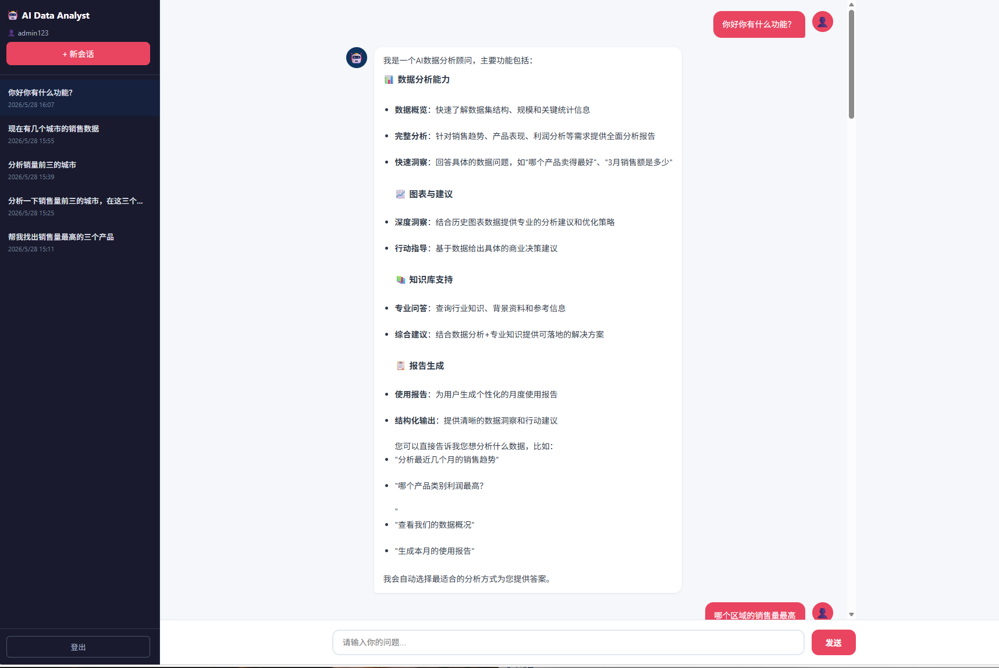
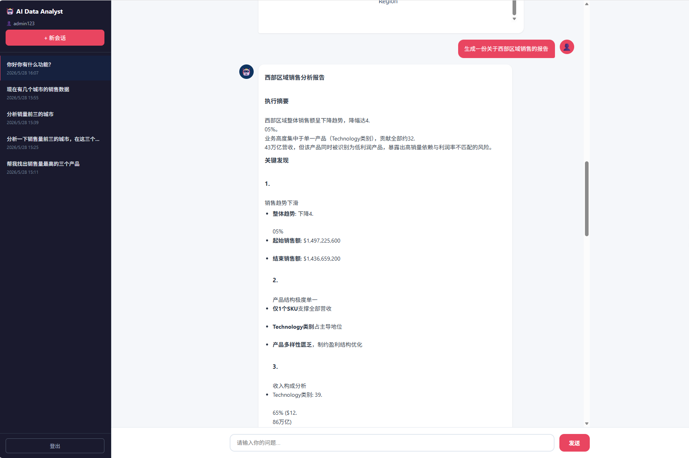
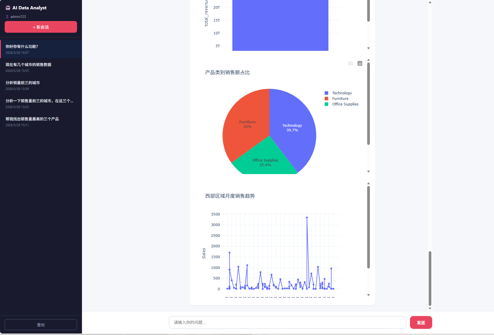

# InsightForge AI — 多智能体协作数据分析平台

> 基于 LangChain + LangGraph 的多智能体协作数据分析平台：自然语言交互、用户上传多格式文件、自动化数据探查、趋势/产品/风险多维分析、交互式图表生成、多格式报告导出。开箱即用的本地化 AI 数据分析助手。

---

## 目录

- [项目亮点](#项目亮点)
- [系统架构](#系统架构)
- [核心功能](#核心功能)
- [Agent 协作流程](#agent-协作流程)
- [技术栈](#技术栈)
- [项目结构](#项目结构)
- [快速开始 (Quick Start)](#快速开始-quick-start)
- [配置说明](#配置说明)
- [API 接口](#api-接口)
- [界面预览](#界面预览)

---

## 项目亮点

- **自然语言驱动，多智能体协作**：用一句话描述需求，多个专业 Agent（规划 / SQL / 趋势 / 产品 / 风险 / 可视化 / 报告 / 导出 / 文本报告）自动编排成完整分析链路，无需手写 SQL 或脚本。
- **多格式文件上传与处理**：支持 **CSV / Excel**（表格类，入 DuckDB 可直接 SQL 查询与跨表 JOIN）和 **PDF / Word / TXT / Markdown**（文本类，入 ChromaDB 向量库做 RAG 问答与摘要报告）。上传后自动解析、分块、向量化，全程进度可视、状态可轮询。
- **多种交互式图表生成**：Visualization Agent 根据数据特征自动选择图表类型，Plotly 渲染 **折线图 / 柱状图 / 饼图 / 热力图 / 散点图**，图表内嵌 SSE 流式回传前端。
- **多格式报告导出**：Jinja2 模板渲染结构化 Markdown 分析报告，一键导出 **Markdown / Word (docx) / PDF / HTML**。
- **配置热重载，无需重启**：在网页「账号设置」面板即可配置 LLM API Key、模型名、向量库连接等，保存后**即时生效**（版本号缓存 + getter 热切换）；API Key 用 Fernet 对称加密存于本地 SQLite，掩码显示。
- **多用户隔离**：DuckDB 按用户缓存独立 `:memory:` 实例，配置 / 文件 / 会话 / 长期记忆全链路按 `owner_user_id` 隔离，多用户并发分析互不串数据。
- **安全加固**：NL→SQL 经 **sqlglot AST 校验 + 只读白名单沙箱**；DuckDB 标识符统一走 `safe_ident()`；拒绝匿名访问、修复会话 IDOR；Markdown 渲染防存储型 XSS、图表 iframe 沙箱化。
- **RAG 检索增强**：两阶段检索——ChromaDB 粗召回 (k=15) + DashScope `gte-rerank-v2` 精排 (top_n=3, 阈值 0.3)，配合 jieba 中文分词，显著提升中文知识库召回质量。
- **混合路由**：ReactAgent 智能判断——文本类文件走 `document_report` 生成摘要/问答报告，表格类文件走 `run_full_analysis` 触发完整 SQL→分析→图表→报告链路，用户无需关心走哪条线。

---

## 系统架构

```
User (FastAPI / Streamlit)
  │
  ▼
ReactAgent (智能客服入口 — LangGraph Agent)
  │  自动判断需求类型，调度工具（共 15 个 @tool）
  │
  ├── rag_sumarize         → RAG 知识库问答（ChromaDB）
  ├── run_full_analysis    → 触发完整分析流程（表格类文件）
  ├── document_report      → 文本类文件摘要/问答报告
  ├── list_user_files      → 列出当前用户文件清单
  ├── quick_data_insight   → 快速数据分析
  ├── get_data_overview    → 数据概况探查（遍历所有 DuckDB 表）
  ├── get_chart_insights   → 图表知识库检索
  ├── get_external_data    → 外部数据查询
  ├── get_customer_overview_tool / get_customer_stats_tool → 客户概况/统计
  ├── fill_report_context_for_report → 注入个性化报告上下文（中间件联动）
  └── get_current_month / get_weather / get_user_location / get_user_id → 辅助上下文工具

       │ (run_full_analysis 内部)
       ▼
Planner Agent (任务规划 — 编排调度)
  │
  ├── SQL Agent          → 自然语言转 SQL → DuckDB 执行 → DataFrame
  ├── Trend Agent        → 趋势分析（增长率、异常检测、同比环比）
  ├── Product Agent      → 产品分析（TOP 排名、类别贡献、利润分析）
  ├── Risk Agent         → 风险分析（异常检测、区域风险、亏损产品）
  ├── Visualization Agent → 图表生成（Plotly：折线/柱状/饼图/热力/散点）
  ├── Report Agent       → 报告生成（Jinja2 模板 → Markdown）
  └── Export Agent       → 多格式导出（Markdown / Word / PDF / HTML）
```

---

## 核心功能

### 数据分析

| 功能 | 描述 |
|------|------|
| SQL 智能查询 | 自然语言自动转 SQL，DuckDB 执行；支持 CSV / Excel 数据源、多表 JOIN |
| 趋势分析 | 月度/年度趋势、增长率、异常检测、时间序列分析 |
| 产品分析 | TOP 产品排名、类别贡献、高销量低利润产品识别 |
| 风险分析 | IQR + Z-score 异常检测、区域风险、利润异常 |
| 图表生成 | Plotly 交互式图表：折线图、柱状图、饼图、热力图、散点图 |
| 报告生成 | Jinja2 模板引擎，自动生成结构化 Markdown 分析报告 |
| 多格式导出 | 支持 Markdown / Word (docx) / PDF / HTML 导出 |

### 智能客服

| 功能 | 描述 |
|------|------|
| RAG 知识库 | ChromaDB 向量检索 + LLM 总结，支持 txt / pdf / docx / md |
| 文本报告 | 文本类文件自动生成「摘要 + 关键要点 + 问答」Markdown 报告 |
| 图表知识库 | SQLite 存储历史图表元数据，支持检索和对比分析 |
| 用户报告 | 外部数据关联，自动生成个性化使用报告 |
| 会话管理 | 多会话切换、对话历史持久化（短期 + 长期记忆） |
| 流式输出 | SSE 流式响应，思考状态实时反馈、打字机效果 |
| 用户认证 | 注册/登录系统，基于 Token 的身份验证 |

### 文件与配置管理

| 功能 | 描述 |
|------|------|
| 多格式上传 | PDF / Word / TXT / MD / CSV / Excel；按扩展名自动分轨路由 |
| 分轨处理 | 文本类 → ChromaDB 向量库；表格类 → DuckDB 表（可直接 SQL/JOIN） |
| 上传进度 | XHR `onprogress` 实时进度；大文件 50MB 提示 / 100MB 硬上限 |
| 解析状态 | 上传后轮询入库状态，完成即可分析 |
| 统一文件视图 | `/api/files` 合并文本/表格两类返回统一列表，支持删除（按类型分流清理向量/表） |
| 配置热重载 | 网页配置 LLM Key/模型名/向量库，保存即时生效，不重启 |
| 加密存储 | API Key 用 Fernet 对称加密存于 SQLite，掩码显示，明文不落盘 |
| 配置优先级 | 用户页面配置 > `.env` 环境变量 > YAML 默认值 |

---

## Agent 协作流程

以用户提问"分析近半年利润下降原因并生成报告"为例：

```
1. Planner Agent
   └── 理解需求 → 拆解为 SQL + Trend + Product + Risk + Viz + Report + Export

2. SQL Agent
   └── 自然语言 → SQL → DuckDB → DataFrame

3. Trend Agent
   └── 月度利润趋势、增长率、异常月份检测

4. Product Agent
   └── TOP/低利润产品、类别贡献分析

5. Risk Agent
   └── IQR + Z-score 异常检测、区域风险识别

6. Visualization Agent
   └── 自动选择图表类型 → 生成 Plotly 交互式图表

7. Report Agent
   └── 整合所有分析 → Jinja2 渲染 → Markdown 报告

8. Export Agent
   └── Markdown → Word / PDF / HTML 多格式导出
```

文本类文件（如上传一份 PDF 产品手册后问"总结这份文档要点"）则走 `document_report` 工具，由 DocumentReportAgent 直接产出「摘要 + 关键要点 + 问答」Markdown 报告，复用 ExportAgent 导出。

---

## 技术栈

| 层级 | 技术 |
|------|------|
| **AI 框架** | LangChain, LangGraph |
| **LLM** | 通义千问 (Qwen), DashScope Embeddings, DashScope Rerank (gte-rerank-v2) |
| **向量数据库** | ChromaDB |
| **中文分词** | jieba（搜索模式，提升图表知识库中文召回） |
| **数据查询** | DuckDB (OLAP 嵌入式数据库，按用户隔离的 `:memory:` 实例) |
| **数据分析** | Pandas, NumPy |
| **可视化** | Plotly (交互式图表) |
| **Web 框架** | FastAPI (SSE 流式), Streamlit |
| **报告导出** | python-docx (Word), ReportLab (PDF), Jinja2 (模板) |
| **记忆系统** | 短期记忆（会话上下文）+ 长期记忆（SQLite 持久化） |
| **数据库** | SQLite（用户认证、用户设置、图表知识库、对话历史、数据源元数据） |
| **安全** | sqlglot AST SQL 沙箱、`safe_ident()` 标识符防注入、bcrypt 密码哈希、Fernet API Key 加密、会话 IDOR 防护、存储型 XSS 防护 |
| **语言** | Python 3.10+ |

### 关键特性

- **多用户并发隔离**：DuckDB 按 `user_id` 缓存独立内存实例，PlannerAgent 请求级状态下沉，多用户并发分析不串数据
- **NL→SQL 安全沙箱**：sqlglot AST 校验 + 白名单只允许 SELECT/WITH/SHOW/DESCRIBE 等只读语句；LLM 生成错误时自动回灌错误信息并重试纠错
- **RAG 检索升级**：chunk 500 + 粗召回 k=15 + DashScope rerank 精排 top_n=3（阈值 0.3）+ jieba 中文分词，检索相关性显著提升
- **知识库运行时管理**：Web 界面上传 / 列表 / 删除 / 全量重建索引，支持 txt / pdf / docx / md 四种格式，无需手动跑脚本入库
- **配置热重载**：网页配置 LLM Key/模型名，保存即生效（版本号缓存 getter 热切换），无需重启服务；API Key Fernet 加密存本地
- **配置统一**：`.env` 作为模型 Key 与名称的单一真相源，YAML 仅作 fallback；优先级：用户页面配置 > `.env` > YAML

---

## 项目结构

```
agent/
├── api/
│   └── fastapi_server.py     # FastAPI Web 服务（SSE 流式 + 用户认证 + 配置/文件管理）
├── agents/
│   ├── planner_agent.py      # Planner Agent — 任务规划与编排
│   ├── sql_agent.py          # SQL Agent — 自然语言转 SQL
│   ├── trend_agent.py        # Trend Agent — 趋势分析
│   ├── product_agent.py      # Product Agent — 产品分析
│   ├── risk_agent.py         # Risk Agent — 风险分析
│   ├── visualization_agent.py # Visualization Agent — 图表生成
│   ├── report_agent.py       # Report Agent — 报告生成
│   ├── document_report_agent.py # DocumentReportAgent — 文本文件摘要/问答报告
│   └── export_agent.py       # Export Agent — 多格式导出
├── agent/
│   ├── react_agent.py        # ReactAgent — LangGraph 智能客服入口
│   └── tools/
│       ├── agent_tools.py    # 工具函数集合（list_user_files / document_report 等）
│       └── middleware.py     # LangGraph 中间件
├── analysis/
│   ├── trend_analysis.py     # 趋势分析算法
│   ├── product_analysis.py   # 产品分析算法
│   └── anomaly_detection.py  # 异常检测算法（IQR + Z-score，Risk/Trend 调用）
├── visualization/
│   └── charts.py             # Plotly 图表生成器
├── rag/
│   ├── rag_service.py        # RAG 检索增强生成
│   ├── vector_store.py       # ChromaDB 向量存储
│   └── chart_knowledge.py    # 图表知识库
├── memory/
│   ├── short_term.py         # 短期记忆（会话上下文）
│   ├── long_term.py          # 长期记忆（SQLite 持久化）
│   └── summarizer.py         # 对话摘要压缩
├── database/
│   ├── duckdb_manager.py     # DuckDB 数据管理（多源加载、safe_ident）
│   ├── user_settings_db.py   # 用户配置存储（Fernet 加密）
│   ├── datasources_db.py     # 数据源元数据（owner_user_id 隔离）
│   ├── schema_loader.py      # Schema 解析
│   ├── data_resolver.py      # 数据集自动检测
│   └── user_db.py            # 用户认证数据库
├── model/
│   └── factory.py            # LLM 模型工厂（getter 热重载 + 版本号缓存）
├── utils/
│   ├── request_context.py    # 请求级 contextvars（user_id 透传）
│   ├── file_handler.py       # 知识库文件加载器（txt/pdf/docx/md）
│   └── ...                   # 其他工具模块
├── config/                   # 配置文件 (YAML)
├── prompts/                  # Prompt 模板（含 document_report.txt）
├── templates/                # Jinja2 报告模板
├── reports/                  # 生成的报告和图表（运行时，已 gitignore）
├── data/                     # 数据文件（含知识库源文件）
├── tests/                    # 测试套件（13 个文件，LLM 调用全 mock，离线可跑）
├── .env.example             # 环境变量模板（可 cp 为 .env 后填写）
├── .env                      # 环境变量（DASHSCOPE_API_KEY、模型名，已 gitignore）
├── requirements.txt          # 依赖清单
└── app.py                    # Streamlit 界面入口
```

**仓库根目录**还包含：
- `README.md` — 本文件
- `CLAUDE.md` — 项目开发指引（给 AI 助手的上下文说明）
- `images/` — 界面运行效果截图（`show_image1~3.png`）
- `docs/` — 设计文档与实施计划（`superpowers/` 子目录）

---

## 快速开始 (Quick Start)

### 1. 环境要求

- Python 3.10+
- Conda（推荐，用于隔离依赖）
- 一个 DashScope (通义千问) API Key —— [在此获取](https://dashscope.console.aliyun.com/)

### 2. 克隆与安装

```bash
git clone <repository-url>
cd Multi-Agent-Data-Analysis-System/agent

# 创建并激活 conda 虚拟环境
conda create -n AnalysisAgent python=3.10
conda activate AnalysisAgent

# 安装依赖
pip install -r requirements.txt
```

### 3. 配置 API Key

仓库已附 `agent/.env.example` 模板，复制后填写即可：

```bash
cp agent/.env.example agent/.env
```

`.env`（**不会提交到 Git**）关键字段：

```dotenv
# DashScope API Key（通义千问 + 向量 + rerank 共用）
DASHSCOPE_API_KEY=sk-your-dashscope-api-key

# 大语言模型名
CHAT_MODEL_NAME=qwen3-max

# 文本嵌入模型名
EMBEDDING_MODEL_NAME=text-embedding-v4

# （可选）用户设置加密密钥；缺失时首次启动会自动生成并写入，请勿提交到 Git
# INSIGHTFORGE_SETTINGS_KEY=
```

> 也可启动后在网页「账号设置」面板里填写 API Key / 模型名并保存，**保存即时生效，无需重启**。网页配置优先级高于 `.env`。API Key 以 Fernet 加密存于本地 SQLite，掩码显示。

### 4. 启动服务

**方式一：FastAPI Web 服务（推荐）**

```bash
conda activate AnalysisAgent
cd agent
python -m api.fastapi_server
# 访问 http://localhost:8502  →  先注册账号 → 登录 → 开始分析
```

**方式二：Streamlit 界面**

```bash
conda activate AnalysisAgent
cd agent
streamlit run app.py
# 访问 http://localhost:8501
```

### 5. 跑通第一次分析（90 秒上手）

1. **登录** → 进入主界面，侧边栏可见「文件管理」「账号设置」面板。
2. **上传文件**：点「文件管理」→ 上传一份 CSV（如销售明细）。表格类文件自动入 DuckDB，状态轮询到「已就绪」即可分析。
3. **提问**（自然语言即可）：
   - `分析各月销售趋势并生成报告` → 走 SQL→趋势→可视化→报告→导出 全链路
   - `哪个产品类别利润最高？` → SQL Agent 直接答
   - 上传一份 PDF 后问 `总结这份文档要点` → 走 `document_report` 文本报告
4. **查看图表**：Plotly 交互式图表内嵌在对话流中，可缩放/悬停查看数据点。
5. **导出报告**：在结论区一键导出 Markdown / Word / PDF / HTML。

### 6. 运行测试（可选，离线可跑，LLM 调用全 mock）

```bash
conda activate AnalysisAgent
cd agent
python -m pytest tests/ -v
```

---

## 配置说明

| 配置文件 | 说明 |
|----------|------|
| `.env` | **真相源**：DASHSCOPE_API_KEY、CHAT_MODEL_NAME、EMBEDDING_MODEL_NAME（已 gitignore） |
| `config/rag.yml` | rerank 模型、粗召回/精排参数、阈值（fallback 模型名） |
| `config/chroma.yml` | ChromaDB 配置（分块大小 chunk_size=500、chunk_overlap=50、允许的文件类型） |
| `config/agent.yml` | 外部数据路径配置 |
| `config/datasources.yml` | 管理员预置数据库连接（MySQL/PostgreSQL），密码经 `password_env` 引用 `.env` 变量 |
| `config/prompts.yml` | Prompt 模板路径配置（含 document_report_prompt_path） |

**配置优先级**：用户网页配置 > `.env` 环境变量 > YAML 默认值。

**RAG 检索参数**（`config/rag.yml`，已预置推荐值，通常无需改动）：

```yaml
rerank_model: gte-rerank-v2      # DashScope rerank 模型（gte-rerank 对部分 Key 返回 403，须用 v2）
retrieve_k: 15                   # 粗召回候选数
rerank_top_n: 3                  # rerank 后保留的文档数
rerank_score_threshold: 0.3     # rerank 分数阈值，低于此分丢弃
```

> ⚠️ 改动 `chunk_size` 后需清库重灌：启动服务后在前端「📚 知识库 → ⟳ 全量重建索引」，或调用 `POST /api/knowledge/reindex`。

---

## API 接口

| 接口 | 方法 | 说明 |
|------|------|------|
| `/` | GET | 登录页面 |
| `/app` | GET | 主应用页面 |
| `/api/register` | POST | 用户注册（密码 bcrypt 哈希，≥8 位） |
| `/api/login` | POST | 用户登录（返回 token） |
| `/api/logout` | POST | 用户登出 |
| `/api/chat` | POST | 智能客服（SSE 流式响应，按 user_id 隔离） |
| `/api/analysis` | POST | 数据分析（同步 JSON，按 user_id 隔离） |
| `/api/sessions` | GET | 获取会话列表 |
| `/api/sessions/{id}` | GET | 获取会话详情 |
| `/api/settings` | GET | 获取当前用户配置（API Key 掩码返回） |
| `/api/settings` | POST | 保存用户配置（热重载，保存即时生效） |
| `/api/settings/status` | GET | 是否已配置（前端横幅/红点提示用） |
| `/api/files` | GET | 统一文件列表（合并文本/表格两类） |
| `/api/datasets` | GET | 列出所有已加载 DuckDB 数据集 |
| `/api/datasets/upload` | POST | 上传 CSV/Excel（multipart，max 100MB）入 DuckDB |
| `/api/datasets/{name}` | DELETE | 删除数据集（DuckDB 表 + 文件 + 元数据） |
| `/api/datasets/{name}/schema` | GET | 数据集 schema、统计、样本行 |
| `/api/datasources/reload` | POST | 热重载 `datasources.yml` 数据库连接 |
| `/api/knowledge/files` | GET | 列出知识库文件（含大小/md5/是否已入库） |
| `/api/knowledge/upload` | POST | 上传文件并增量入库（multipart，支持 txt/pdf/docx/md） |
| `/api/knowledge/files/{filename}` | DELETE | 删除文件及其向量分片 |
| `/api/knowledge/reindex` | POST | 清库全量重建索引（需 `confirm=true`） |
| `/api/knowledge/stats` | GET | 知识库统计（分片数/来源数/维度） |
| `/api/health` | GET | 健康检查 |

---

## 界面预览

- **登录页**：用户注册/登录（bcrypt 加密、密码强度校验）
- **主界面**：左侧会话列表 + 文件管理 + 账号设置面板 + 右侧对话区
- **文件管理面板**：多格式上传、进度条、解析状态徽章、按类型删除
- **账号设置面板**：LLM API Key（掩码）/ 模型名配置，保存即热重载
- **思考状态**：spinner 动画 + 当前执行步骤提示
- **流式输出**：分析结论逐句呈现
- **图表嵌入**：Plotly 交互式图表内嵌展示
- **报告下载**：支持 Markdown / Word / PDF / HTML 下载

### 运行效果截图



---

*本项目由 InsightForge AI 多智能体协作数据分析系统驱动*
